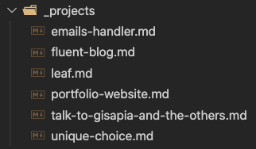
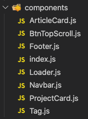
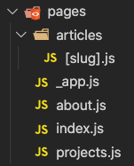
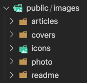
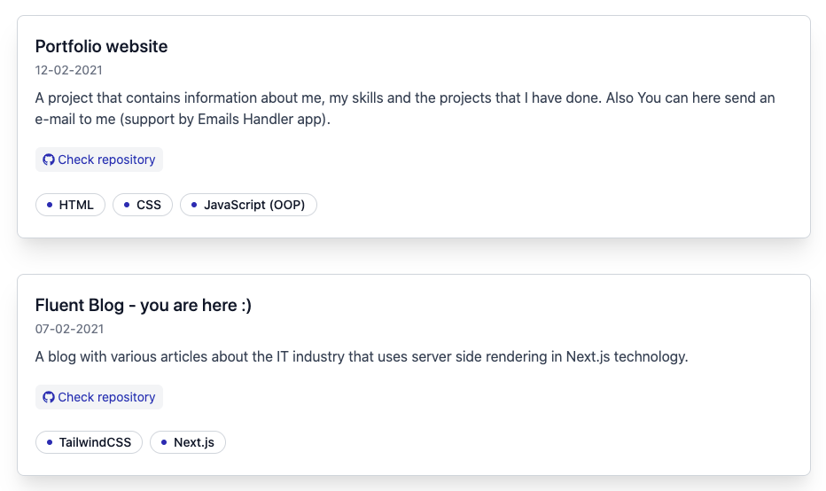
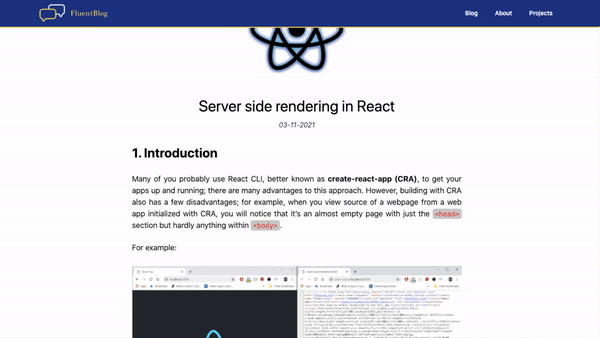

# FluentBlog

### Desktop version:


<br/>

### Mobile version:


<br/>

### Live version is available [here](https://fluent-blog.vercel.app/).

<br/>

## Table of Contents

1. General info
2. Technologies
3. Setup
4. Features

   <br/>

## 1. General info

The site is dedicated to blogging about the IT industry and it contains various articles, author's description and completed projects for the portfolio.

<br/>

## 2. Technologies

The following technologies were used in the project:

- Next
- TailwindCSS

  <br/>

## 3. Setup

First of all, you need to make sure you have [Node.js](https://nodejs.org/en/) installed.

<br/>

If you have Node.js installed use the following command:

```
npx create-next-app
# or
yarn create next-app
```

<br/>

After that, run the development server:

```
npm run dev
# or
yarn dev
```

Open [http://localhost:3000](http://localhost:3000) with your browser to see the result.

<br/>

## 4. Features

The entire project was created using Next and TailwindCSS technologies due to the speed and ease of development, efficiency and the ability to render the code on the server side, which contributes to better SEO.

<br/>

The list of the most interesting solutions in this project is presented below:

<br/>

### 4.1. General: <br/>

&nbsp; 4.1.1. Basic configuration

&nbsp; 4.1.2. TailwindCSS and its configuration

&nbsp; 4.1.3. The structure of folders in the project and their descriptions

<br/>

### 4.2. Specific: <br/>

&nbsp; 4.2.1. Adding data related to portfolio projects dynamically

&nbsp; 4.2.2. A dynamic way of creating a page with the content of an article

&nbsp; 4.2.3. A button that allows to quickly return to the top of the page

&nbsp; 4.2.4. A loader before displaying a specific article

<br/>
<br/>

## 4.1. General

In this section, I will focus on the general description of the various solutions that have been introduced in the project.

<br/>

### 4.1.1. Basic configuration

The project uses several solutions that allow for easier application development. Below is a list of these solutions:

- Eslint, which allows You to catch bugs during development. Its configuration is below:

```
//.eslintignore file:

node_modules
.next

//.eslintrc.js file:

module.exports = {
  root: true, // Make sure eslint picks up the config at the root of the directory
  parserOptions: {
    ecmaVersion: 2020, // Use the latest ecmascript standard
    sourceType: 'module', // Allows using import/export statements
    ecmaFeatures: {
      jsx: true // Enable JSX since we're using React
    }
  },
  settings: {
    react: {
      version: 'detect' // Automatically detect the react version
    }
  },
  env: {
    browser: true, // Enables browser globals like window and document
    amd: true, // Enables require() and define() as global variables as per the amd spec.
    node: true // Enables Node.js global variables and Node.js scoping.
  },
  extends: [
    'eslint:recommended',
    'plugin:react/recommended',
    'plugin:jsx-a11y/recommended',
    'plugin:prettier/recommended' // Make this the last element so prettier config overrides other formatting rules
  ],
  rules: {
    'react/prop-types': 'off',
    'prettier/prettier': ['error', {}, { usePrettierrc: true }], // Use our .prettierrc file as source
    'react/react-in-jsx-scope': 'off',
    'jsx-a11y/anchor-is-valid': [
      'error',
      {
        components: ['Link'],
        specialLink: ['hrefLeft', 'hrefRight'],
        aspects: ['invalidHref', 'preferButton']
      }
    ]
  }
};
```

<br/>

- Prettier, which keeps the code clean. Its configuration is below:

```
//.prettierignore file:

node_modules
.next

//.prettierrc file:
{
  "semi": true,
  "tabWidth": 2,
  "printWidth": 100,
  "singleQuote": true,
  "trailingComma": "none",
  "jsxBracketSameLine": true
}
```

<br/>

- Absolute import, that make the code a lot cleaner, more readable and manageable. Its configuration is below:

```
//jsconfig.json file:

{
  "compilerOptions": {
    "baseUrl": "."
  }
}
```

<br/>

### 4.1.2. TailwindCSS and its configuration

The project uses a framework called TailwindCSS which is a utility-first CSS framework for rapidly building custom user interfaces (writing styles is done by using special classes defined in the framework).

<br/>

Below is an example of using this framework for an div html element:

```
//components/ProjectCard.js file:

<div className="relative border-yellow-900"></div>
```

In the example above, the following styles have been added to the div element:

- relative - which relate to the position: relative property
- border-yellow-900 - which relate to the border-color: rgb(120, 53, 15) (intensive yellow)

<br/>

Below is the Tailwind CSS configuration along with the configuration of the support tools:

```
//tailwind.config.js file:

module.exports = {
  purge: ['./components/**/*.{js,ts,jsx,tsx}', './pages/**/*.{js,ts,jsx,tsx}'],
  darkMode: 'media', // 'media' or 'class'
  theme: {
    extend: {
      colors: {
        'accent-1': '#333'
      }
    }
  },
  variants: {
    extend: {}
  },
  plugins: []
};


//postcss.config.js file:

module.exports = {
  plugins: ['tailwindcss', 'autoprefixer']
};
```

<br/>

### 4.1.3. The structure of folders in the project

The folder structure in the project is as follows (folders with an underline "\_" are associated with generating static pages (data that builds pages)):

- the \_articles folder contains the markdown files that contain the content related to the articles. Below is a visual example of the contents of this folder:

&nbsp; &nbsp; &nbsp; &nbsp; 

<br/>

- the \_projects folder contains the markdown files that contain the content related to my projects. Below is a visual example of the contents of this folder:

&nbsp; &nbsp; &nbsp; &nbsp;

<br/>

- the .next folder contains various files related to the next framework. Below is a visual example of the contents of this folder:

&nbsp; &nbsp; &nbsp; &nbsp;

<br/>

- the components folder contains the javascript files which are related to the individual components used in the project. Below is a visual example of the contents of this folder:

&nbsp; &nbsp; &nbsp; &nbsp;

<br/>

- the containers folder contains the javascript files which are related to the container for some components (layout for the application). Below is a visual example of the contents of this folder:

&nbsp; &nbsp; &nbsp; &nbsp;

<br/>

- the contexts folder contains the javascript files which are related to the Context API solution that are used to save and share specific data between app logic. Below is a visual example of the contents of this folder:

&nbsp; &nbsp; &nbsp; &nbsp;

<br/>

- the lib folder contains the javascript files which are related to craeted libraries that make our work easier (cache libraries). Below is a visual example of the contents of this folder:

&nbsp; &nbsp; &nbsp; &nbsp;

<br/>

- the node_modules folder contains various files which contain various functionalities related to the app. Due to the large size of this folder, I will not present it below.

- the pages folder contains the javascript files which correspond to each page of the app. Below is a visual example of the contents of this folder:

&nbsp; &nbsp; &nbsp; &nbsp;

<br/>

- the public folder contains various files which contain so-called static files such as images. Below is a visual example of the contents of this folder:

&nbsp; &nbsp; &nbsp; &nbsp;

<br/>

- the services folder contains the javascript files which contain support functions. Below is a visual example of the contents of this folder:

&nbsp; &nbsp; &nbsp; &nbsp;

<br/>

- the styles folder contains the css files which are related to the specific app styles. Below is a visual example of the contents of this folder:

&nbsp; &nbsp; &nbsp; &nbsp;

<br/>
<br/>

## 4.2. Specific

In this section, I will focus on a more detailed description of the various functionalities that have been introduced in the project

<br/>

### 4.2.1. Adding data related to portfolio projects dynamically

Next js allows us to add data to the page in a dynamic way. For this process, files with the markdown extension will be used, in which we can write various texts as in a regular text editor, but we can also save different data as in a normal database.

At the very beginning, I would like to focus on the possibility of dynamic adding data regarding the projects I have completed.

<br/>

An example of one of the markdown files with mentioned data is shown below:

```
<!-- _projects/portfolio-website.md file: -->

---
title: Portfolio website
description: A project that contains information about me, my skills and the projects that I have done. Also You can here send an e-mail to me (support by Emails Handler app).
date: 12-02-2021
link: https://github.com/damian-lis/Portfolio-Website
tags:
  - HTML
  - CSS
  - JavaScript (OOP)
---
```

As we can see above, we have different attributes and their values (tittle, descirption, date, links and tags (which in this form is an array)) which are related to the Portfolio Website project.

<br/>

To display mentioned data from markdown files on the page, we need logic that will parse this data for us. Below is example of the function (backend logic) that make it possible:

```
//lib/markdownParser.js file:

export const getList = (path) => {
  const directory = join(process.cwd(), path);
  const files = fs.readdirSync(directory);

  return files.map((file) => {
    const fullPath = join(directory, file);
    const fileContents = fs.readFileSync(fullPath, 'utf-8');
    const { data } = matter(fileContents);

    return {
      ...data,
      slug: file.replace('.md', ''),
      createdAt: data.date ? Number(new Date(data.date)) : null
    };
  });
};
```

In the case of the getList function we have the following logic:

- the function takes a path parameter (e.g. projects from which we will extract files),
- variable directory, to which the specific folder path is returned (e.g. \_projects), which, thanks to the use of the process.cwd function, always starts in the folder in which NodeJS works (allows to avoid errors on other devices),
- the files variable, to which the file names of the previously read folder were returned (array),
- finally, the discussed function returns an array with objects that contains parsed data based on iteration over predetermined files (this data was read using the gray-matter library).

<br/>

To sum up, the function discussed above allows to download and modify the specific data from the markdown file (data of projects) to a form that can then be used on the frontend.

<br/>

In order to be able to introduce some modifications (e.g. sorting) to the returned data by getList function while keeping the code clean, the getAllProjects function was introduced, the implementation of which is presented below:

```
//services/projects.js file:

import { getList } from 'lib/markdownParser';

export const getAllProjects = () => {
  const projects = getList('_projects');

  return projects.sort((a, b) => a.createdAt - b.createdAt).reverse();
};
```

As we can see above, the getAllProjects function returns the data (projoects) that were returned by calling the previously discussed getList function passing the parameter "\_projects" (folder name)

<br/>

Having the logic responsible for parsing the data, below is the logic thanks to which the parsed data can be read on the frontend side:

```
//pages/projects.js

import Layout from 'containers/Layout';
import Head from 'next/head';
import { getAllProjects } from 'services/projects';
import { ProjectCard, Tag } from 'components';

export const getStaticProps = () => {
  const projects = getAllProjects();

  return {
    props: { projects }
  };
};

export default function Projects({ projects }) {
  return (
    <>
      <Head>
        <title>Projects</title>
      </Head>
      <Layout>
        <div>
          <h1 className="text-center text-3xl mb-10 mt-10">MY PROJECTS</h1>
          <ul className="mb-8">
            {projects.map((project) => (
              <ProjectCard key={project.title} project={project} TagComponent={Tag} />
            ))}
          </ul>
        </div>
      </Layout>
    </>
  );
}
```

In the above example, we first see the getStaticProps function (next function), which is called when we build our project on the server.

The discussed function returns boject with props in the form of projects that were returned when calling the previously described getAllProjects function.

Then these props (projects) are received through the Projects function component and when iterating over them are passed to the ProjectCard function component, which displays it in an appropriate manner (the entire implementation of the ProjectCard function component can be found here components/ProjectCard.js).

<br/>

Below is a visual example of dynamically created projects description:



<br/>

### 4.2.2. A dynamic way of creating a page with the content of an article

In this subsection, I'd like to focus on extending the functionality that was discussed in the previous subsection.

<br/>

First, an example markdown file containing information about the article is presented below:

```
<!-- _articles/immer-vs-ramda.md file: -->

---
title: Immer vs Ramda -
description: Two approaches towards writing Redux reducers
cover: /images/covers/immerVsRamda.png
date: 02-20-2021
tags:
  - immer
  - javascript
  - webdev
  - redux
---

Reducers - a core element of Redux's philosophy that tightly grabs mutations of a given state in one place. In theory, the pure nature of reducers should lead to great scalability, readability, and make us all fortunate children of Redux god. But even the brightest idea can be dimmed if thrown on the one most pediculous soil...

Yes. I speak about JavaScript. Writing complex pure functions in vanilla JavaScript is harsh. Avoiding mutations is extraordinarily hard. Matching against actions? There are no Variants/Enums in JS, you have to use strings instead. And you land with a poor switch statement taken straight from the hell. Regardless, Redux is the most popular state manager for React applications

## The path to purity

Consider the two ways to make your life easier, the first one will be the Immer - Immer is a package that lets you deliver the next state by "mutating" the draft of the previous state:

Article copied from **[here](www.dev.to/fkrasnowski/immer-vs-ramda-two-approaches-towards-writing-redux-reducers-3fe0)**
```

In the example above, we see a dataset at the beginning that looks very similar to the one presented at the beginning of the previous subsection for projects. In the second part of the example, we can see the content of the article, which requires a different functionality to be dynamic displayed on the website (this process will be described later).

<br/>

To create teasers based on a dataset (the first part of the example discussed above), we will use the logic that was already described in the previous subsection. An example of its implementation is shown below:

```
//pages/index.js file:

import Layout from 'containers/Layout';
import Head from 'next/head';
import { ArticleCard } from 'components';
import { getListOfArticles } from 'services/articles';

export const getStaticProps = () => {
  const articles = getListOfArticles('_articles');

  return {
    props: { articles }
  };
};

export default function Home({ articles }) {
  return (
    <>
      <Head>
        <title>Blog - recent posts</title>
      </Head>
      <Layout>
        <section>
          <ul className="flex flex-row flex-wrap mx-auto">
            {articles.map((article) => (
              <ArticleCard key={article.title} article={article} />
            ))}
          </ul>
        </section>
      </Layout>
    </>
  );
}
```

As we can see above, this is the same logic that I discussed before, only instead of a project dataset we have a dataset of articles.

<br/>

Below is a visual example of dynamically created article teasers:


To create a page of a specific article in a dynamic way (after clicking on a specific article teaser), a [slug].js file has been created in the pages/articles folder (it will dynamically build the page depending on the so-called article slug, i.e. its name).

However, before I go to the above-mentioned file, below I would like to present a few solutions that the above file uses.

<br/>

Below is the logic that is responsible for parsing a specific article content:

```
//lib/markdownParser.js file:

export const getFileBySlug = async (path, slug) => {
  const directory = join(process.cwd(), path);
  const fullPath = join(directory, `${slug}.md`);
  const fileContents = fs.readFileSync(fullPath, 'utf-8');
  const { data, content: markdownContent } = matter(fileContents);
  let content = '';

  if (markdownContent) {
    content = await remark().use(html).use(prism).process(markdownContent);
    content = content.toString();
  }

  return {
    ...data,
    content,
    slug,
    createdAt: data.date ? Number(new Date(data.date)) : null
  };
};
```

In the case of the getFileBySlug async function we have the following logic:

- the appropriate article path and slug are passed to the function,
- a path to our articles folder is created (directory variable),
- the full path to the article is created (fullPath variable),
- the content of this file is processed (content as markdownContent) and converted to html (matter library),
- a content variable is created with an empty string assigned (in case the specific file has no content),
- if there is content in a specific file, the processed content is returned to the content variable using the asynchronous remark function (remark library),
- at the very end, the processed content is converted into a string and returned along with the rest of the article data (in object).

<br/>

To sum up, the logic of the function described above is responsible for downloading and modifying data from the markdown file (article) to a form that can then be used on the frontend.

<br/>

Below are the support functions (which use the previously discussed functions) that will be used in the dynamic creation of an article on the website (as in the case of the dynamic display of project data that I discussed earlier):

```
//services/articles.js file:

import { getList, getFileBySlug } from 'lib/markdownParser';

export const getListOfArticles = () => {
  const articles = getList('_articles');

  return articles.sort((a, b) => a.createdAt - b.createdAt).reverse();
};

export const getArticle = async (slug) => {
  const article = await getFileBySlug('_articles', slug);

  return article;
};
```

As we can see above, the first function getListOfArticles uses the getList function (the function discussed in the previous subsection) which returns the sorted list of articles, and the second function getArticle returned the processed content with data of the article (the function discussed a moment ago).

With the logic responsible for returning the processed data and the content of the article already explained, now I can clearly explain the logic of the [slug].js file, which is responsible for the dynamic creation of the specific article on the website.

<br/>

Below is an implementation of this solution:

```
//pages/articles/[slug].js file:

import { useContext, useEffect } from 'react';
import Head from 'next/head';
import Image from 'next/image';
import Layout from 'containers/Layout';
import { getArticle, getListOfArticles } from 'services/articles';
import LoadingContext from 'contexts/loading';

export const getStaticPaths = async () => {
  const articles = getListOfArticles('_articles');

  return {
    paths: articles.map((art) => ({ params: { slug: art.slug } })),
    fallback: false
  };
};

export const getStaticProps = async (req) => {
  const { slug } = req.params;
  const article = await getArticle(slug);

  return {
    props: { article }
  };
};

export default function Article({ article }) {
  const { setLoad } = useContext(LoadingContext.store);

  useEffect(() => {
    setLoad(false);
  }, []);

  return (
    <Layout>
      <Head>
        <title>{article.title}</title>
        <link href="https://unpkg.com/prismjs@0.0.1/themes/prism-okaidia.css" rel="stylesheet" />
      </Head>
      <div className="flex flex-col p-5">
        <div className=" mx-auto mt-10">
          <Image
            src={article.cover}
            width="490"
            height="225"
            alt="Blog Cover"
            className="rounded rounded-lg  "
          />
        </div>

        <h1 className="text-center text-4xl mb-3 mt-10 ">{article.title}</h1>
        <span className="text-center  text-gray-700 italic">{article.date}</span>
        <div
          className="max-w-3xl w-full mx-auto articleBody text-justify "
          dangerouslySetInnerHTML={{ __html: article.content }}
        />
      </div>
    </Layout>
  );
}
```

In the above example, we first see the getStaticPaths function (next function which is called when we build our project on the server), that returns an object with an array with the paths to the articles (using the getListOfArticles function) that next will use to generate each subpage for the article (so we can link to each article) and fallback which allows next for dynamic page generation if someone adds a new article.

Then, the getStaticProps asynch function returns the processed content of the specific article (as a props), which is returned by the getArticle function, to which the retrieved slug parameter is passed.

At the very end of the example discussed above, in the Article function component, the above-mentioned props is received and destructurized (single article) and displayed with the appropriate jsx on the client side (the same as for displaying projects and article teasers).

It should also be added that the content of the article is passed to the Article function component in the form of html and in this case the dangerouslySetInnerHTMLs React prop was used (in the last div element), which allows it.

<br/>

Below is a visual example of a dynamically generated article:


<br/>

### 4.2.3. A button that allows to quickly return to the top of the page

The project uses the solution that if the user scrolls the page down, a so-called back button will appear on the right side of the page that will allow him to quickly return to the top of the page without scrolling.

<br/>

Below is an visual example of this solution:



<br/>

For the above process is responsible component named BtnTopScroll, the implementation of which is below:

```
//components/BtnTopScroll.js file:

import { useEffect, useState } from 'react';

export default () => {
  const [isShow, setIsShow] = useState(false);
  const [isFooter, setIsFooter] = useState(false);

  const handleScrollToTop = () => window.scrollTo({ top: 0, behavior: 'smooth' });

  const handleSetFooter = () =>
    window.innerHeight + window.scrollY + 25 >= document.body.offsetHeight
      ? setIsFooter(true)
      : setIsFooter(false);

  const handleShowScrollBtn = () => (window.scrollY > 200 ? setIsShow(true) : setIsShow(false));

  useEffect(() => {
    window.addEventListener('scroll', () => {
      handleSetFooter();
      handleShowScrollBtn();
    });
  }, []);

  return (
    <div
      className={` ${
        isShow ? (isFooter ? 'bottom-20' : 'bottom-10') : '-bottom-20'
      } transition-all  mx-auto fixed  w-full`}>
      <div className="relative  max-w-5xl mx-auto">
        <button
          onClick={handleScrollToTop}
          className="focus:outline-none bg-yellow-300 p-7 absolute right-5 bottom-0 h-3 w-3 rounded-full flex justify-center items-center  ml-auto text-2xl text-blue-900 bg-opacity-90 cursor-pointer">
          <i className="fas fa-arrow-up "></i>
        </button>
      </div>
    </div>
  );
};
```

As we can see the above mentioned function component has quite extensive logic, which I explain chronologically below:

- at the beginning, using the useState hook, two states are created (isShow and isFooter) along with the functions that set them (setIsShow and setIsFooter),
- a function handleScrollToTop is created to scroll the screen on page to the top,
- a function handleSetFooter is created that sets the isFooter state value using the setIsFooter function depending on the condition (if the footer edge is reached during the scrolling, then the isFooter state value is set to true, otherwise to false),
- a function handleShowScroallBtn is created that sets the isShow state value using the setIsShow function depending on the condition (if the page scroll is above 200px then the isShow state value is set to true, otherwise to false),
- a function is passed to the useEffect hook that sets the event scroll on the window object, which calls the two previously described functions (handleSetFooter and handleShowScrollBtn),
- at the very end, jsx is returned, in which, depending on the state (isShow and isFooter), the appropriate styles are displayed and on the event onClick of button element is set the previously described handleScrollToTop function.

<br/>

Below is an example of the use of this component in the so-called page layout:

```
//containers/Layout.js file:

import { Navbar, Footer, Loader, BtnTopScroll } from 'components';

export default ({ children }) => {
  return (
    <>
      <Loader />
      <Navbar />
      <div className="max-w-7xl mx-auto px-2 sm:px-6 lg:px-8 ">
        <div className="h-16 bg-red-200"></div>
        <main className="min-h-screen ">{children}</main>
      </div>
      <Footer />
      <BtnTopScroll />
    </>
  );
};
```

As we can see in the example above, it is a component that appears alongside other major components such as Navbar and Footer, which are available on every page.

<br/>

### 4.2.4. A loader before displaying a specific article

When the user uses weaker equipment or has access to weaker internet speed, a situation may arise that pages related to specific articles may load in a few seconds. To increase the user experience of using the application, the so-called loader has been created, which informs the user that the content is being loaded.

<br/>

Below is a visual example of this solution:


<br/>

For the above process is responsible component named Loader, the implementation of which is below (along with the content of the associated file):

```
//contexts/loading.js file:

import { createContext, useState } from 'react';

const store = createContext();
const { Provider } = store;

function LoadingProvider({ children }) {
  const [load, setLoad] = useState(false);

  return (
    <Provider
      value={{
        load,
        setLoad
      }}>
      {children}
    </Provider>
  );
}

const LoadingContext = {
  store,
  LoadingProvider
};

export default LoadingContext;


//components/Loader.js file

import { useContext, useEffect, useState } from 'react';
import LoadingContext from 'contexts/loading';

export default () => {
  const { load } = useContext(LoadingContext.store);
  const [showInfo, setShowInfo] = useState(false);
  let timeoutIndex;
  const time = 2000;

  useEffect(() => {
    if (load) {
      document.body.style.overflow = 'hidden';
      timeoutIndex = setTimeout(() => {
        setShowInfo(true);
      }, time);
    } else {
      setShowInfo(false);
      clearTimeout(timeoutIndex);
      document.body.style.overflow = 'auto';
    }
  }, [load]);

  return (
    load && (
      <div className=" flex flex-col justify-center items-center h-screen w-screen bg-gray-900 bg-opacity-60 fixed z-20 overflow-hidden">
        <div className="object-center loader ease-linear rounded-full border-8 border-t-8 border-gray-200 h-32 w-32"></div>
        <p className="mt-4 text-lg leading-relaxed text-white">Wczytuję artykuł...</p>
        {showInfo && (
          <p className="px-5 text-center mt-1 text-lg leading-relaxed text-white">
            Strona ładuje się dłużej niż zwykle... Prosimy o cierpliwość!
          </p>
        )}
      </div>
    )
  );
};
```

As we can see above, in addition to the implementation of the Loader component, the content of the contexts/loading.js file were presented, which is responsible for an easy way of saving and sharing the saved data regarding the Loader component.

<br/>

Before I go to the description of the logic related to the Loader component, I would like to describe the logic of the context regarding this component in a chronological manner (first part of example above):

- the object from the createContext function is returned to the variable store,
- the Provider component is destructurized from the store object and assigned to a variable with the same name,
- in the LoadingProvider function component, a state is created using the useState hook (load and the setLoad function to set the load state) and the previously mentioned Provider component is returned along with a passed props named value with the state object and functions for setting this state (load and setLoad), and the so-called children which were passed to the LoadingProvider functional component,
- at the very end, the LoadingContext object is exported, which contains the store object and the LoadingProvider function component.

<br/>

Now I would like to go on to describe in chronological manner the logic that occurs in the Loader component:

- as a result of calling the useContext function to which the store object of the LoadingContext's object is passed, the object is returned, from which the load state is extracted (previously described),
- the showInfo state is created, along with the setShowInfo function to set that state,
- the variable timeoutIndex has been declared,
- to the time variable was assigned 2000 value,
- a function was passed to the useState hook (dependent on load state), in which if the load state is true, the overflow property of the body object will be set to hidden and the setTimeout function will be called after a predetermined time (time variable), which sets the showInfo state to true using the setShowInfo function (the setTimeout function was returned to the timeoutIndex variable for reference). If the load state is false, the setShowInfo function will set the showInfo state to false, the clearTimeout function will delete the setTimeout function waiting to be called (if it has not yet been executed) and the overflow property of the body object will be set to auto,
- at the very end, jsx is returned, in which, if the loader state is true then the loader structure will be returned and if the showInfo state is true then the information about the longer loading will be displayed (for better user expeence).

<br/>

The loader component is placed in the Layout structure as shown in the example below:

```
import { Navbar, Footer, Loader, BtnTopScroll } from 'components';

export default ({ children }) => {
  return (
    <>
      <Loader />
      <Navbar />
      <div className="max-w-7xl mx-auto px-2 sm:px-6 lg:px-8 ">
        <div className="h-16 bg-red-200"></div>
        <main className="min-h-screen ">{children}</main>
      </div>
      <Footer />
      <BtnTopScroll />
    </>
  );
};
```

As we can see above, the Loader component, as in the case of BtnTopScroll component, is placed next to the main Navbar and Footer components.

<br/>

It should be mentioned that the change of state that activates the loader on the page (mentioned earlier load state) is influenced by the ArticleCard component, an excerpt of which is presented below:

```
export default ({ article }) => {
  const { setLoad } = useContext(LoadingContext.store);
  return (
      //more code...

    <Link href={`/articles/${article.slug}`}>
      <a onClick={() => setLoad(true)} className="hover:underline">
        <h2 className="text-1xl font-bold tracking-normal text-gray-800">{article.title}</h2>
     </a>
    </Link>

       //more code...
  )
}
```

As we can see in the example above, on the event onClick of a element, the setLoad function is set (context state), which changes the load state to true (this makes the loader appear on the user's page).

<br/>

It should also be mentioned that the change of state that deactivates the loader on the page is influenced by the Article function component, an excerpt of which is presented below:

```
export default function Article({ article }) {
  const { setLoad } = useContext(LoadingContext.store);

  useEffect(() => {
    setLoad(false);
  }, []);

//more code...
}
```

As we can see above, thanks to the useEffect hook, the load state (context state) is set to false using the setLoad function (when the article is loaded).

Finally, I would like to summarize that setting the loader state was possible in a few files due to the use of a solution called Context API (which was described at the beginning of this subsection).
